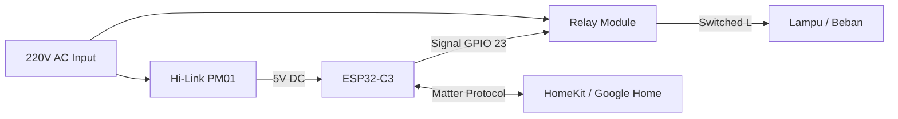

# ⚡ Kapaksitor Nexora V1
<p align="center">
<strong>Premium Matter-Enabled Smart Switch</strong>

<sub>DIY Smart Home Module with ESP32-C3, AC-DC Integrated, and Native Voice Assistant Support</sub>
</p>
<p align="center">


</p>

## 📋 Daftar Isi
- [Mengapa Nexora V1?](#-mengapa-nexora-v1)
- [Fitur Utama](#-fitur-utama)
- [Komponen & Hardware](#-komponen--hardware)
- [Arsitektur Sistem](#-arsitektur-sistem)
- [Skema Wiring](#-skema-wiring)
- [Panduan Pairing](#-panduan-pairing)
- [Troubleshooting](#-troubleshooting)

## 🚀 Mengapa Nexora V1?
Nexora V1 hadir untuk menjembatani kesenjangan antara perangkat IoT DIY yang berantakan dengan ekosistem Smart Home profesional. Menggunakan protokol 

**Matter**, perangkat ini tidak memerlukan akun pihak ketiga dan bekerja secara *native* di Apple Home, Google Home, dan Alexa.
| Keunggulan | Deskripsi |
|---|---|
| **AC-DC Integrated** | Sudah termasuk modul Hi-Link, tidak butuh adaptor tambahan. |
| **Native Ecosystem** | Terdeteksi langsung sebagai "Light" di ekosistem besar. |
| **State Memory** | Menggunakan Preferences.h, status relay tetap terjaga saat mati lampu. |
| **OTA Ready** | Update fitur jarak jauh tanpa bongkar casing. |

## 🧩 Komponen & Hardware
| Komponen | Fungsi |
|---|---|
| **ESP32-C3 Super Mini** | Kontroler utama (Matter Stack, WiFi, Logic). |
| **Hi-Link HLK-PM01** | Power supply internal (AC 220V to DC 5V). |
| **Relay Module (5V)** | Saklar pemutus arus beban (Lampu/Kipas). |
| **Terminal Block 2-Pin (2x)** | Konektor input (PLN) dan output (Beban). |
| **Tactile Switch** | Tombol manual + Factory Reset (GPIO 4). |
| **LED Built-in** | Indikator status WiFi & Matter (GPIO 2). |

## 🏗️ Arsitektur Sistem


## 🔌 Skema Wiring

> **⚠️ PERINGATAN:** Matikan MCB utama sebelum menyambungkan kabel. Nexora V1 bekerja dengan tegangan tinggi 220V!

1. **INPUT Side:** Hubungkan kabel Fasa (L) dan Netral (N) dari jalur PLN ke terminal INPUT
2. **OUTPUT Side:** Hubungkan kabel ke beban (Lampu/Kipas)
3. **Catatan:** Terminal Netral pada output adalah *pass-through* dari input
## 📱 Panduan Pairing

1. **Power On:** Hubungkan Nexora ke listrik. LED (GPIO 2) akan berkedip Biru pelan
2. **WiFi Setup:** Connect ke SSID `Mochi-Smart-Switch` (WiFiManager) dan masukkan kredensial WiFi rumah
3. **Scan Matter:** Buka aplikasi Google Home/Apple Home → *Add Device* → *Matter Device*
4. **QR Code:** Scan stiker QR yang tertempel di unit (Default PIN: `20202021`)

## 🐞 Troubleshooting

### Alat Tidak Merespon (Lampu Mati)
**Gejala:** LED built-in tidak menyala.

**Solusi:**
- Cek terminal INPUT
- Pastikan kabel Fasa dan Netral terpasang kencang
- Verifikasi arus PLN aktif

### Gagal Pairing Matter
**Gejala:** Aplikasi memunculkan pesan "Device Not Found".

**Solusi:**
- Pastikan HP berada di jaringan WiFi yang sama
- Lakukan **Factory Reset**: Tekan dan tahan tombol fisik (GPIO 4) selama 10 detik hingga LED berkedip cepat
- Ulangi proses pairing

### Status di App Tidak Sinkron
**Gejala:** Relay berbunyi tapi di aplikasi statusnya tertinggal.

**Solusi:**
- Cek koneksi WiFi
- Nexora akan mencoba *auto-reconnect* setiap 10 detik secara non-blocking

### Update Gagal
**Gejala:** OTA terputus di tengah jalan.

**Solusi:**
- Dekatkan alat dengan router
- Atau pasang antena eksternal jika menggunakan casing 3D print yang tebal

## 📁 Struktur Proyek
```
kapaksitor-nexora-v1/
├── firmware/
│   ├── main.ino            # Logic Matter + Preferences + OTA
│   └── config.h            # Pin definition & Matter Params
├── hardware/
│   ├── casing-v1.stl       # File 3D Print (Modular Box)
│   └── schematic.pdf       # Wiring diagram internal
└── docs/
    ├── manual_book.pdf     # Panduan cetak untuk user
    └── pairing_qr.png      # Template QR Code Matter
```

<div align="center">

**© 2026 Kapaksitor Labs**

</div>
